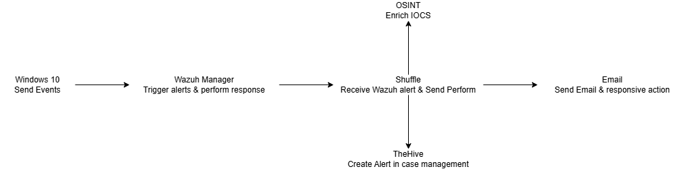

# SOC Automation Lab

## Objective
The SOC Automation Platform project aims to create an integrated security operations workflow that:

- Automates routine SOC tasks to reduce manual analysis and response time
- Demonstrates end-to-end threat detection and response using open-source tools
- Provides a reusable reference architecture for small/medium security teams
- Bridges these core security technologies:
  - Wazuh (SIEM for detection)
  - TheHive (Case management)
  - Shuffle (Workflow automation)

## Skills Learned

- Designed correlation rules in Wazuh for detecting brute force attacks, suspicious processes.
- Developed custom TheHive templates for consistent case documentation
- Development of critical thinking and problem-solving skills in cybersecurity.

## Workflow Breakdown

1. **Windows 10:** Sends security event logs to Wazuh for analysis.
2. **Wazuh Manager:** Detects security threats, triggers alerts, and performs initial responses.
3. **Shuffle:** Acts as the automation hub, receiving Wazuh alerts and:
	  - Enriching IOCs (Indicators of Compromise) using OSINT sources.
    - Creating case alerts in TheHive for further investigation.
    - Sending email notifications with responsive actions.
4. **TheHive:** Serves as the case management platform, logging incidents for investigation.
5. **Email Notifications:** Used for alerting SOC analysts and triggering automated responses.

